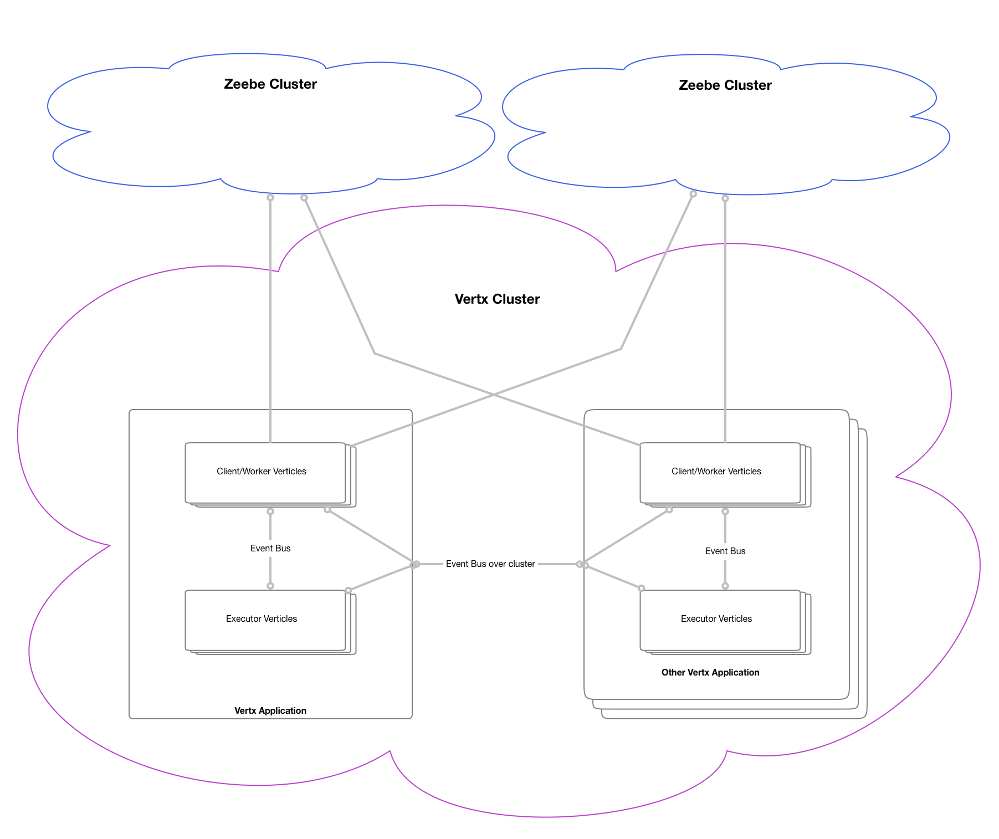

# quintessential-tasklist-zeebe
The quintessential Zeebe tasklist for BPMN Human tasks with Drag and Drop Form builder, client and server side validations, and drop in Form Rendering

WIP

Setup SLF4J logging: `-Dvertx.logger-delegate-factory-class-name=io.vertx.core.logging.SLF4JLogDelegateFactory`

vertx run command: `run com.github.stephenott.MainVerticle -conf src/main/java/com/github/stephenott/conf/application.json`

# Components

1. Vertx ZeebeClient verticle (leverages the io.zeebe.client lib)
1. Vetx ZeebeWorker verticle
1. Client configuration using Vertx standards
1. Compartmentlizations of a ActivatedJob for sending over the wire (Event bus)
1. Human Task API to recreate and improve upon (simplify?) Camunda Human Task design.

# Cluster Architecture

- Zeebe Worker design to support a Vertx Cluster that have 1-N Zeebe Clients that can connect to 1-N Zeebe Clusters.
- Zeebe Workers support clustering of 1-N, the same design as the Zeebe Clients.  Workers are independent of Clients.
- Clients and Workers can be added at startup and during runtime.
- Failed nodes in the Vertx Cluster (Clients or Workers) will be re-instantiated through the vertx cluster manager's configuration. 
- Vertx Applications may choose to only run as a Worker within the cluster, and do work for other clients.

# Notes

1. Implements clusterings and scaling through Vertx instances
1. ZeebeClientVerticle can increase in number of instances: 1 instance == 1 ZeebeClient Channel connection
1. ZeebeWorkerVerticle is independent of ZeebeClient.  You can scale workers across the cluster to any number of instances and have full cluster feature set
1. Workers will return completed task data to the client verticle that requested the work. (Likely to change in future to support sending work back through any client connected to same broker)
1. Workers can do work from any Zeebe Cluster, as they are independent of the ZeebeClient